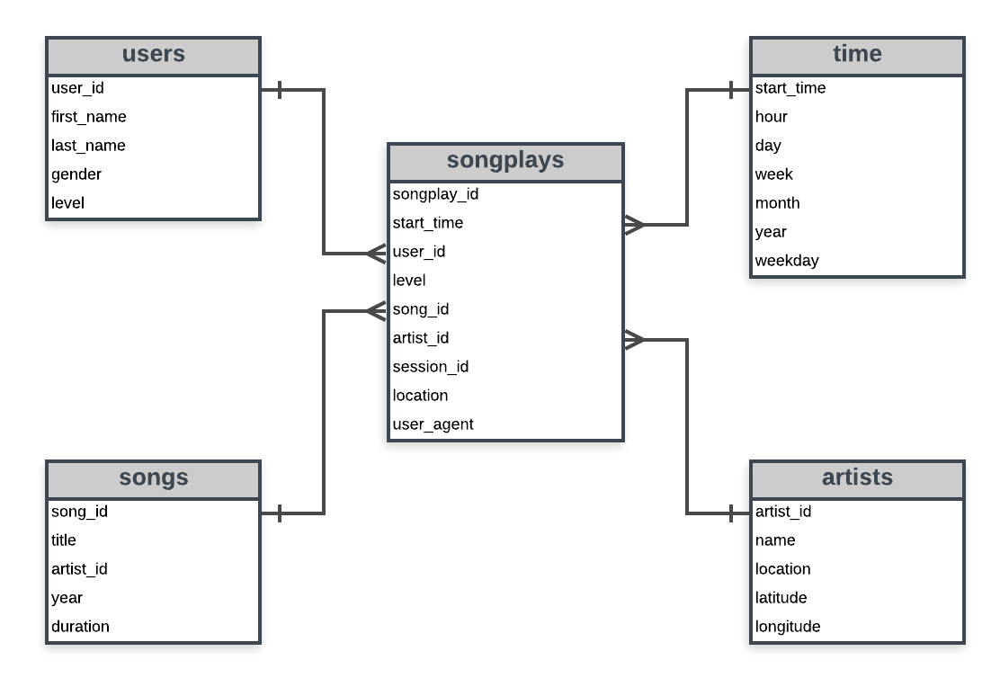

# Data Modeling for a Music Streaming App called Sparkify.

In this project, I have the role of a Data Engineer at a fabricated data streaming company called “Sparkify”. It is a startup and wants to analyze the data they’ve been collecting on songs and user activity on their new music streaming app. The analytics team is interested in understanding what songs users are listening to. Currently, they don’t have an easy way to query their data, which resides in a directory of JSON logs on user activity on the app, as well as a directory with JSON metadata on the songs in their app.

Because of that, my role on this project is to create a Postgres database with tables designed to optimize queries on song play analysis.

## Description of the work done

In this project, I’ve applied what I’ve learned on data modeling with Postgres and build an ETL pipeline using Python. I’ve defined fact and dimension tables for a star schema for a particular analytic focus and written an ETL pipeline that transfers data from files in two local directories into these tables in Postgres using Python and SQL. 

###### Now lets take a brief walk trough the datasets:

## Song Data

The first dataset is a subset of real data from the Million Song Dataset. Each file is in JSON format and contains metadata about a song and the artist of that song. The files are partitioned by the first three letters of each song’s track ID. For example, here are file paths to two files in this dataset.

    song_data/A/B/C/TRABCEI128F424C983.json
    song_data/A/A/B/TRAABJL12903CDCF1A.json

And below is an example of what a single song file, TRAABJL12903CDCF1A.json, looks like.

    {"num_songs": 1, "artist_id": "ARJIE2Y1187B994AB7", "artist_latitude": null, "artist_longitude": null, "artist_location": "", "artist_name": "Line Renaud", "song_id": "SOUPIRU12A6D4FA1E1", "title": "Der Kleine Dompfaff", "duration": 152.92036, "year": 0}

## Log Data

The second dataset consists of log files in JSON format generated by this event simulator based on the songs in the dataset above. These simulate activity logs from a music streaming app based on specified configurations.
The log files in the dataset you’ll be working with are partitioned by year and month. For example, here are file paths to two files in this dataset.

    log_data/2018/11/2018-11-12-events.json
    log_data/2018/11/2018-11-13-events.json

And below is an example of what the data in a log file, 2018-11-12-events.json, looks like.


## Principal Schema for the Song Play Analysis

Using the song and log data, I've designed the star schema optmized for queries on song play analysis. The following tables compose the schema: 

### Fact Table

#### songplays
records in log data associated with song plays i.e records with page ```NextSong.``` 
The columns in this table are: *songplay_id, start_time, user_id, level, song_id, artist_id, session_id, location, user_agent.*

### Dimension Tables

#### users
This table is used to store data about the users in the app.
The columns in this table are: *user_id, first_name, last_name, gender, level*

#### songs
This table is for the songs in the music database.
The columns in this table are: *song_id, title, artist_id, year, duration*

#### artists
This table is for the artists in the music database.
The columns in this table are: *artist_id, name, location, latitude, longitude*

#### time 
This table is just for the timestamp of records in songplays. Here, we broke down the timestamp in seven different units.
The columns in this table are: *start_time, hour, day, week, month, year, weekday*

The following diagram shows the star schema that we have



In addition to the schema, I should explain what kind of files that we have here:

* test.ipynb displays the first few rows of each table to check the database.
* create_tables.py drops and creates the tables. I run this file to reset my tables before each time I run my ETL scripts.
* etl.ipynb reads and processes a single file from song_data and log_data and loads the data into the tables. This notebook contains a detailed explanation of the ETL process for each of the tables. Use this notebook if you want know the details of the ETL process.
* etl.py reads and processes files from song_data and log_data and loads them into the tables.
* sql_queries.py contains all the SQL queries, and is imported into the last three files above.

## ETL Pipeline 

To develop the ETL pipeline, we focus on a central function called ```process_data```. You can pass the file path and the process function you need to process your data. It gets all files matching extension (.json) from the directory. And then it iterates over files and processes using your function passed into.

Here is how it is defined: 

```def process_data(cur, conn, filepath, func):
    # get all files matching extension from directory
    all_files = []
    for root, dirs, files in os.walk(filepath):
        files = glob.glob(os.path.join(root,'*.json'))
        for f in files :
            all_files.append(os.path.abspath(f))

    # get total number of files found
    num_files = len(all_files)
    print('{} files found in {}'.format(num_files, filepath))

    # iterate over files and process
    for i, datafile in enumerate(all_files, 1):
        func(cur, datafile)
        conn.commit()
        print('{}/{} files processed.'.format(i, num_files))
```

### Process ```song_data```

First, lets see how can we handle ``song_data`` and create the ``songs`` and ``artists`` tables. I’ve built ```process_song_file``` function to perform the following tasks:

1. First, get a list of all song JSON files in data/song_data
2. Read the song file
3. Extract Data for Songs Table and Insert Data into Songs Table
4. Extract Data for Artists Table and Insert Data into Artists Table

#### Extract Data for Song Table

To extract data for Songs table, the following tasks are done:

1. Select columns for song ID, title, artist ID, year, and duration
2. Use ``df.values`` to select just the values from the DataFrame
3. Index to select the first (only) record in the DataFrame
4. Convert the array to a list and set it to ``song_data``

Finally, insert all this data into ``songs`` table.

#### Extract Data for Artists Table and Insert Record into Artist Table

Data Extraction for Artists table is similar to that for Songs table, but this time I selected columns artist ID, name, location, latitude, and longitude.

### Process ``log_data``

Second, I’ve performed ETL on the second dataset, ``log_data``, to create the ``time`` and ``users`` dimensional tables, as well as the ``songplays`` fact table.

#### Extract Data for Time Table and Insert Records into Time Table

I’ve filtered records by ``NextSong`` action

    df = df[df['page']=='NextSong']

and converted the ``ts`` timestamp column to DateTime.

    t = pd.to_datetime(df['ts'], unit='ms')

Obs: I've transformed the timestamp to miliseconds

#### Extract Data for Users Table and Insert Records into Users Table

Data extraction for users table is easy, just select columns for user ID, first name, last name, gender, and level and set to user_df and insert records for the users in this log file into the users table.

Obs: use ``on conflict update`` for the user table since the level can change from free to paid.

#### Extract Data and Songplays Table

This one is a little more complicated since the information from the ``songs`` table, ``artists`` table and original log file are all needed for the ``songplays`` table. Since the log file does not specify an ID for either the song or the artist, I needed to get the song ID and artist ID by querying the ``songs`` and ``artists`` tables to find matches based on the song title, artist name, and the song’s duration time.

Since this is a subset of the much larger dataset, the solution dataset will only have 1 row with values containing ID for both *songid* and *artistid* in the fact table. Those are the only 2 values that the query in the **sql_queries.py** will return that is not-NONE. The rest of the rows will have NONE values for those two variables.

## How to Run

1. Run ``create_tables.py``
2. Run ``etl.py``
3. Run ``test.ipynb`` to test the tables and the process.

## Conclusion

As a Data Engineer, my work now is done. I’ve created a Postgres database with tables designed to optimize queries on song play analysis. The analytics team has now an easy to query their data and analyze understanding what songs users are listening to.

